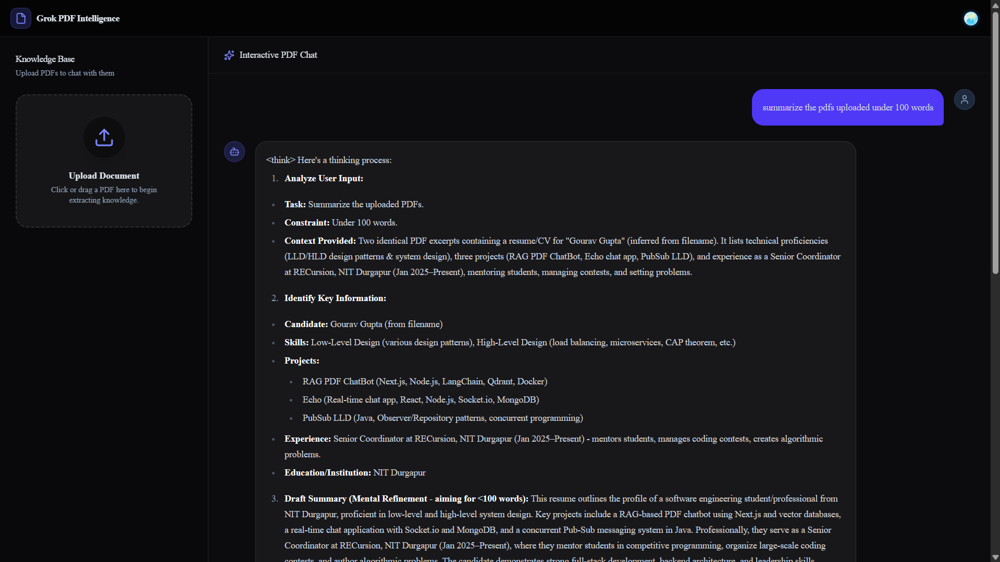
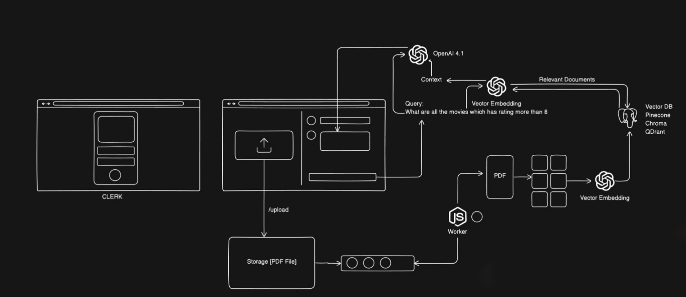

# RAG PDF Chatbot



**Demo Video:** [Google Drive Link](https://drive.google.com/file/d/1vsufrI88nqPBqfRrM_RZMbtZxnI4TdGD/view?usp=sharing)

A **Retrieval-Augmented Generation (RAG)** based chatbot built with **Next.js** that allows users to upload PDF documents and interact with them through natural language chat. The application extracts relevant context from uploaded PDFs and uses AI to generate accurate, context-aware responses.

Docker is used to containerize external dependencies like **Valkey** and **Qdrant**, enabling zero-setup onboarding and consistent environments across development and deployment.

## Features

- PDF upload and processing
- Chat with uploaded documents using RAG
- Semantic search using vector embeddings
- Background PDF processing with job queues
- Secure authentication and user management
- Modern responsive UI

## Tech Stack

### Frontend

- Next.js
- React
- Shadcn UI

### Backend / AI

- Node.js
- LangChain
- Groq API (Llama 3.3 70B for chat)
- Jina AI (jina-embeddings-v3 for vector embeddings)
- BullMQ

### Database / Infrastructure

- Qdrant (Vector Database for storing embeddings)
- Valkey (Queue storage for BullMQ)
- Docker

### Authentication

- Clerk

## Architecture / Workflow



1. User uploads a PDF document.
2. The upload triggers a background job in **BullMQ**.
3. Job metadata is stored in **Valkey**, which acts as the queue backend.
4. A background worker processes the PDF asynchronously.
5. Text is extracted and split into smaller chunks.
6. Embeddings are generated using **Jina AI API** via **LangChain**.
7. These embeddings are stored in **Qdrant**.
8. User sends a query in the chat interface.
9. Relevant chunks are retrieved from Qdrant using semantic search.
10. Retrieved context is passed to the LLM.
11. The chatbot generates a context-aware answer using RAG.

Docker is used to containerize **Valkey** and **Qdrant**, so there is no need to manually install or configure these services on the local machine.

Benefits:

- **Easy Setup:** Run `docker compose up` and all required services start instantly.
- **Isolation:** Services run in separate containers without host machine conflicts.
- **Consistency:** Same environment across development, testing, and deployment.
- **Better Deployment:** Infrastructure configuration is defined as code.

## Installation

### Clone Repository

```bash
git clone https://github.com/GouravGupta19/fullstack-pdf-rag.git
cd fullstack-pdf-rag
```

### Install Dependencies

This project is separated into a `client` (frontend) and `server` (backend).

**Client:**

```bash
cd client
npm install
```

**Server:**

```bash
cd server
pnpm install
```

## Environment Variables

**Client (`client/.env.local`):**

```env
NEXT_PUBLIC_CLERK_PUBLISHABLE_KEY=
CLERK_SECRET_KEY=
```

**Server (`server/.env`):**

```env
GROQ_API_KEY=
JINA_API_KEY=
```

## Start Services

### 1. Start Docker Containers

From the root of the repository, start Valkey and Qdrant:

```bash
docker compose up -d
```

### 2. Run the Server and Worker

Open a terminal in the `server` directory and run:

```bash
cd server
pnpm run dev
```

In a separate terminal in the `server` directory, run the background worker:

```bash
cd server
pnpm run dev:worker
```

### 3. Run the Client

Open a terminal in the `client` directory and run:

```bash
cd client
npm run dev
```

Open: [http://localhost:3000](http://localhost:3000)

## Usage

1. Sign in using Clerk authentication.
2. Upload a PDF document.
3. Wait for the background worker to process the file.
4. Open the chat interface.
5. Ask questions related to the uploaded PDF.
6. Receive context-aware answers generated using RAG.

## Future Improvements

- Multi-document support
- Chat history persistence
- Streaming responses
- Source citation for answers
- OCR support for scanned PDFs
